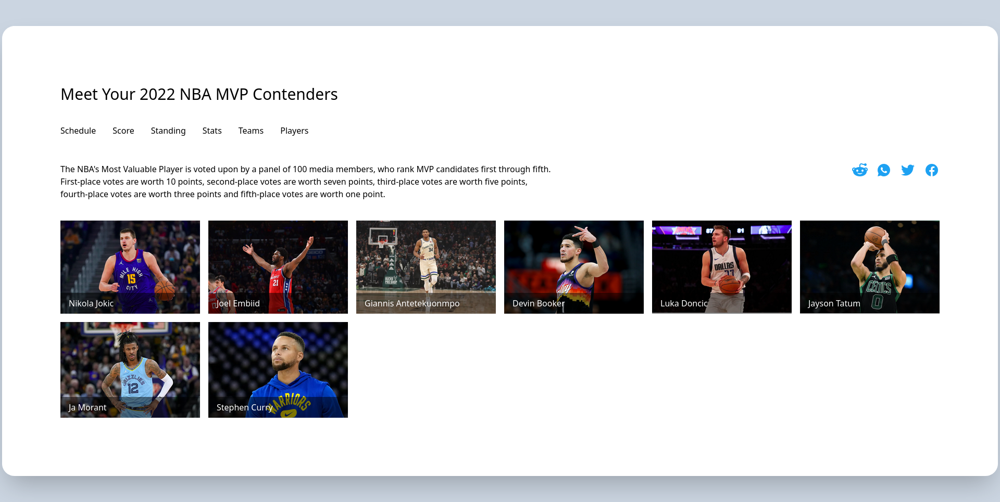

# Image-Gallery
A mini-project created as a part of the Udemy Course: TailwindCSS from Scratch.

It is a design for  image gallery that is frequently used for showcasing assets like pictures, videos, or boxes in popular image hosting sites (like instagram), portfolio sites, news aggregation sites etc. It also includes data displayed about the image when mouse is hovered over the image.
Modifications are inspired from the sportingnews.com article of the same name.

## Made Using

## Screenshots
### Web-view

### Shorter Viewport

