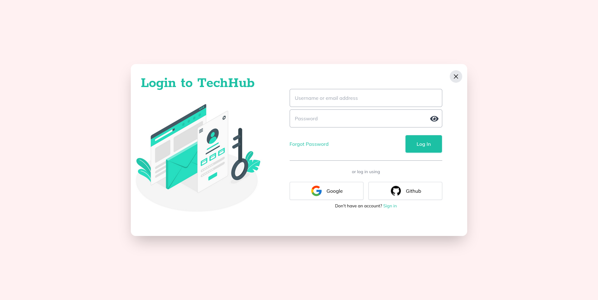
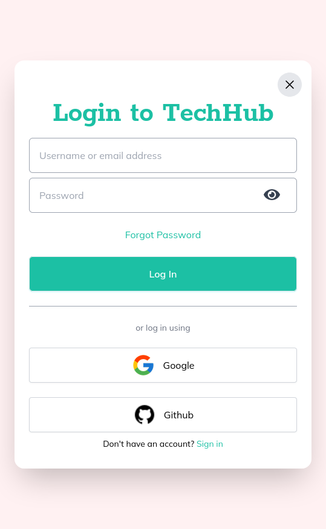

# Login-Modal
A mini-project created as a part of the Udemy Course: TailwindCSS from Scratch.

It is a design for a login modal that is used in service provider websites, social media sites, forums, or anything that involves either data aggregation for a particular user or any service that customizes user experiences for each user. Modifications are inspired by the login modal for payfully.com.

The password functionality is powered using alpinejs.

## Made Using

## Screenshot
### Web-view

### Mobile View
