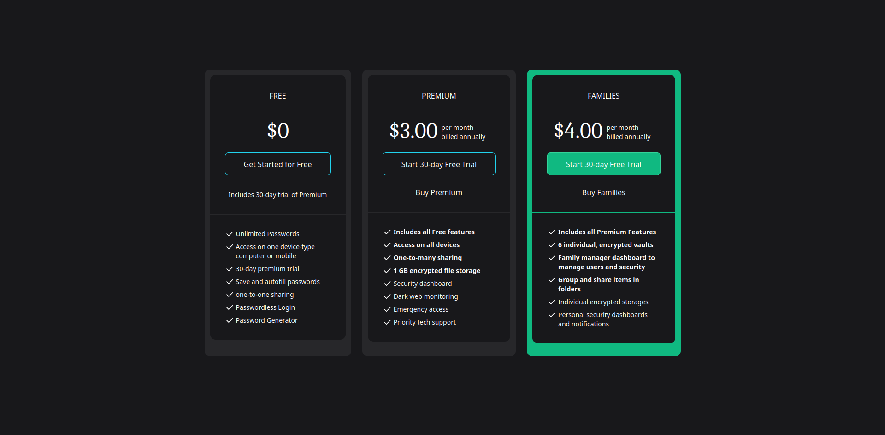

# Pricing Grid Mini-Project
A mini-project created as a part of the udemy course: TailwindCSS from Scratch.

It is a design for product grids with multiple pricing tiers available for various SaaS offerings available and their respective features.
Modifications are inspired from the lastpass product catalogue.
## Made using:

## Screenshots:

