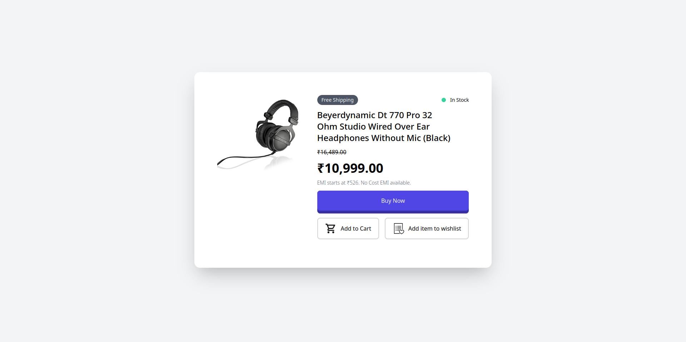
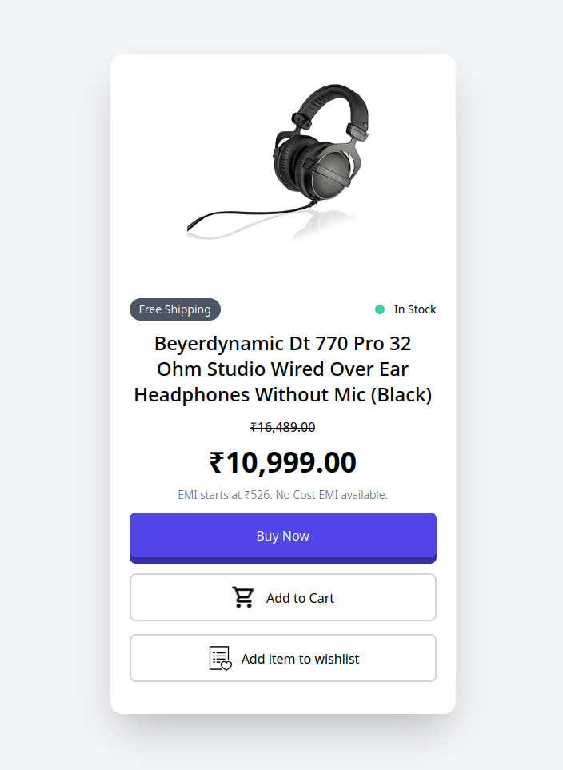

# Product-Modal
A mini-project created as a part of the Udemy course: TailwindCSS from Scratch. 

It is a modal design for showcasing a product that is used frequently in e-commerce websites with the necessary features added on the frontend.
Modifications are inspired from amazon.in listing for the featured product.

## Made Using

## Screenshots
### Web-view

### Mobile View

