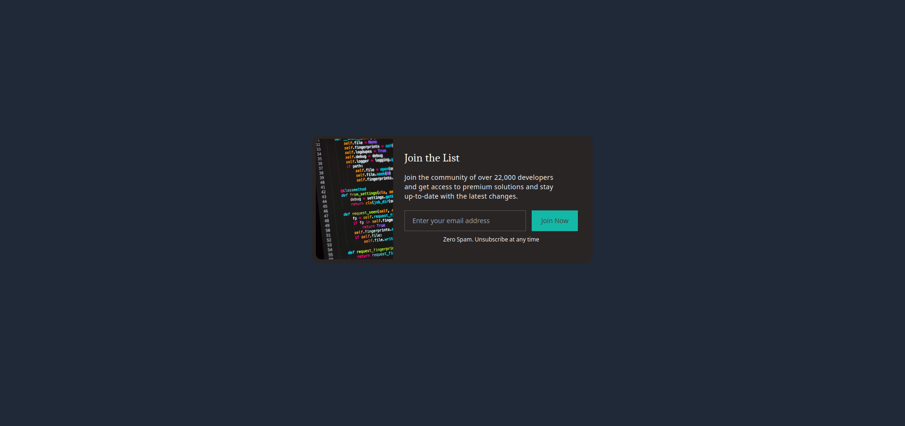

# Email Subscription Project
A mini-project created as a part of the udemy course: TailwindCSS from Scratch. 

It is a design for subscription cards for newsletter or product website.
Modifications are inspired from https://www.madfientist.com/.
## Made using:

## Screenshot

